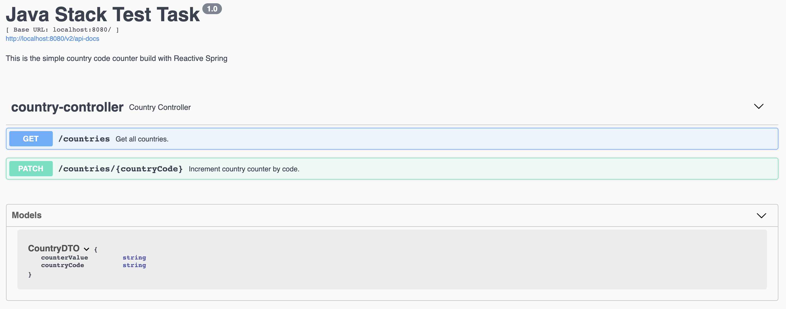

# Java stack test task

The purpose of this project is to demonstrate how to solve the task 
using modern solutions like Reactor and async jdbc drivers.

This project uses [PostgreSQL](https://github.com/r2dbc/r2dbc-postgresql) implementation of the R2DBC SPI.

# How to build and run

project can be compiled with JDK 11 and above `javac`.

To compile just do `mvn clean package`.

## Prerequisites

* JAVA 11 should be installed
* Postgres should be up and running at : <localhost:5432>

To run the application execute the following:

```
java -jar target/java-stack-test-task*.jar
```

You can also use the Swagger-UI to test the application.


The server will start at <http://localhost:8080>.

## Exploring the Rest APIs

The Swagger UI will open at : <http://localhost:8080/swagger-ui/index.html>

The application contains the following REST APIs

```
1. GET /countries - Get All Countries
2. PUT /countries/{countryCode}?action=increment - Update country counter by country code.
```

### Loading
This app contains Dockerfile, so you can use k8s to scale your instances.
To run the app with locally please check that Docker has already installed and execute the following command.

```
    docker-compose up
```
